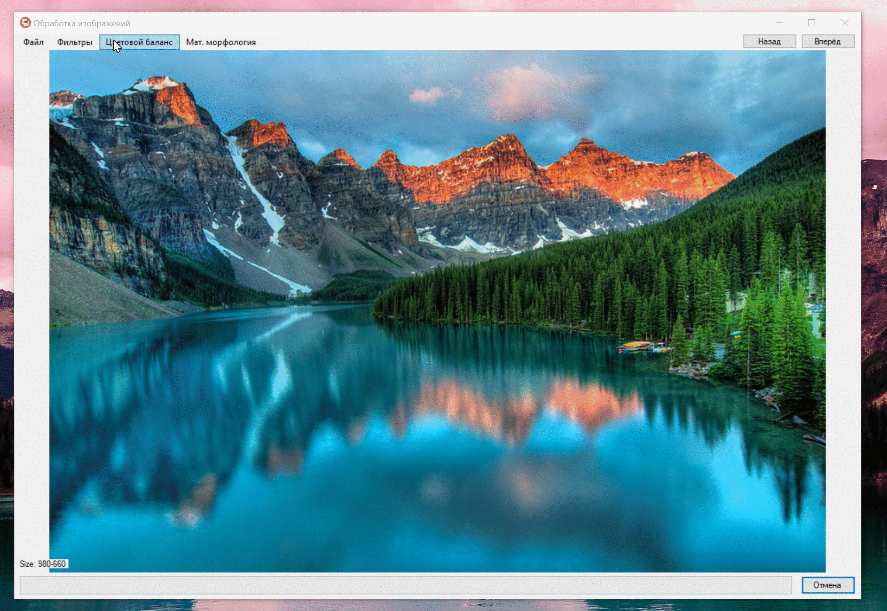
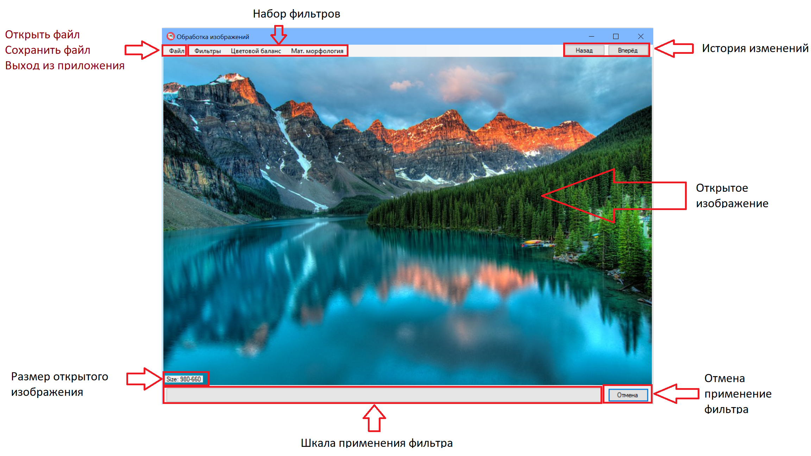

  

# Готовые фильтры для изображений

## Данный проект имеет реализацию готовых фильтров, которые можно применить к изображению.

### Поддерживаемые расширения:
* JPG
* PNG	
* ICO	
* BMP
* TIF

### Пример работы:

#### Интерфейс. 
 

 
#### Пример применения фильтров. 
 

 
 
## Набор реализованных фильтров:

1. Точечные

	1.1 Инверсия
	
	1.2 Полутоновый
	
	1.3 Сепия
	
	1.4 Растяжение гистограммы
	
	1.5 Увеличить яркость
	
	1.6 Серый мир
	
	1.7 Волны (60 и 30 градусов)
	
	1.8 Стекло
	
2. Цветовой баланс

	2.1 Выделить красный цвет
	
	2.2 Выделить зелёный цвет
	
	2.3 Выделить синий цвет
		
3. Матричные

	3.1 Размытие
	
	3.2 Размытие Гаусса
	
	3.3 Медианный фильтр
	
	3.4 Увеличение резкости
	
	3.5 Максимальная резкость
	
	3.6 Размытие в движении
		
4. Математическая морфология

	4.1 Dilation (расширение) 
	
	4.2 Erosion	(сужение)

## Об интерфейсе

 
 
#### Окно является маштабируемым, изображение внутри подстраивается под размер окна.
 

## Как скачать приложение?

### ВАЖНО: При скачивании проекта к себе на компьютер, вам потребуется подключить библиотеку AForge самостоятельно

### удобнее всего это сделать через систему внешних пакеетов NuGet.После подключения скомпилируйте проект.

### Скомпилированное приложение можно скачать тут:

#### <https://disk.yandex.ru/d/at14Ebe2sLLSww>
		
	
